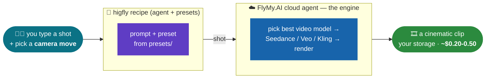

# higfly 🎬

**We killed Higgsfield.** Cinematic AI video - camera moves, viral looks - built from **one prompt**, Claude as the builder, **FlyMy.AI cloud** as the backend.

- **Open**: Higgsfield's "camera presets" are just prompts. Ours ship as plain text you own and edit ([`presets/`](presets/)) - no locked studio, no account required to read them. Your keys, your storage, the agent is a forkable template.
- **Cheap**: no subscription, no expiring credits. **Pay-per-clip** on the same frontier models Higgsfield resells (Seedance 2.0, Veo 3.1, Kling) - **~$0.20-0.50 a clip** on our real bill vs their **$5-99/mo** credit plans that reset monthly.

## Higgsfield, honestly

Higgsfield is a **$1.3B** company. What it sells is real - a slick studio, one-click viral VFX, director-grade presets. But under the hood it **aggregates the same frontier video models** (Sora, Veo 3.1, Kling, **Seedance 2.0**, WAN) and wraps them in camera-move prompts, then bills a subscription with credits that expire. **FlyMy.AI hosts those same models.** So higfly calls them directly, keeps the camera moves as open prompt templates, and you pay per clip instead of per month.

## How we did it



One FlyMy.AI agent, frozen into a fixed pipeline, + open presets. The agent IS the engine - it renders on the right frontier model; the presets are the "Higgsfield magic" as editable text.

## Build it yourself

1. **Connect FlyMy.AI to your coding agent** - one line:
   ```bash
   claude mcp add --transport http flymyai https://mcp-agents.flymy.ai/mcp
   ```
   (claude.ai / Codex / Antigravity: add the same URL as an MCP connector, sign in with [flymy.ai](https://app.flymy.ai).)
2. **Paste one prompt** from [BUILD_PROMPT.md](BUILD_PROMPT.md) - it clones this repo, creates YOUR agent, renders a clip, and shows you the real bill.
3. **Make a shot.** Done.

## Use it directly

higfly V1 is a recipe you run on **your** account through the FlyMy.AI MCP - no binary to trust, no baked-in credentials:

1. Create the agent from [agent/prompt.md](agent/prompt.md) on your account (one paste into your coding agent - it pins the model and the flymy-mcp tool).
2. Render a shot: give it a prompt + a [camera-move preset](presets/camera-moves.md). The clip lands in your storage, billed to your key at **~$0.20-0.50/clip**.

That's the whole product: one frozen agent + open presets. A standalone CLI and a desktop studio are on the roadmap (see [BUILD_LOG.md](BUILD_LOG.md) for what is and isn't shipped).

## Numbers, receipts, dead ends

| | Higgsfield | higfly |
|---|---|---|
| Price | **$5-99/mo** credits (reset monthly, top-ups expire in 90 days) | **~$0.20-0.50 per clip, pay-per-use** - no subscription |
| Models | Sora, Veo 3.1, Kling, Seedance 2.0, WAN - behind credits | the same frontier models, called directly |
| Camera presets | in-app, locked | open prompt templates in [`presets/`](presets/), yours to edit |
| Lock-in | account + monthly credits | your keys, your storage, forkable agent |

Quality, honestly: Higgsfield's studio polish, preset library and their own DoP model are a real edge - we don't claim to out-polish them. We claim you can **own the same frontier models + open presets at per-clip cost**, instead of renting them by the month.

Full timestamped build history, real billed prices, and every dead end are in [BUILD_LOG.md](BUILD_LOG.md).

## License

MIT.
