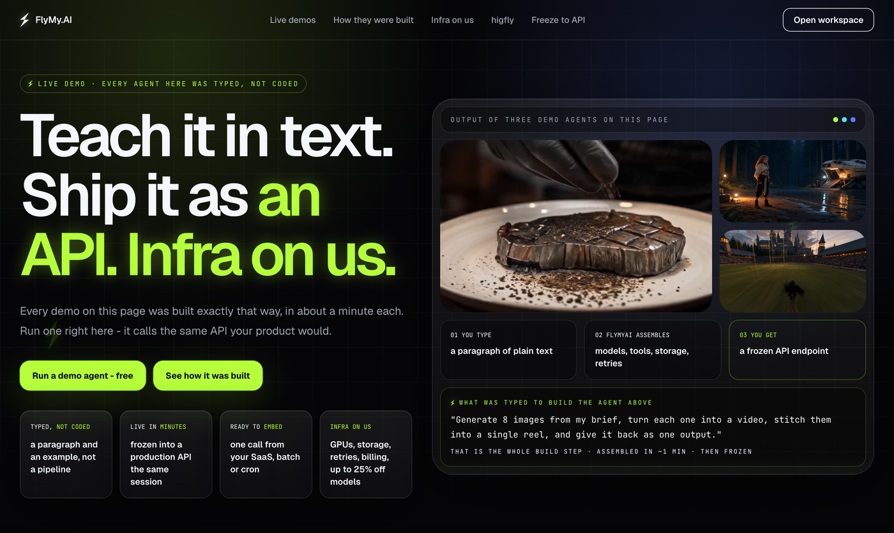
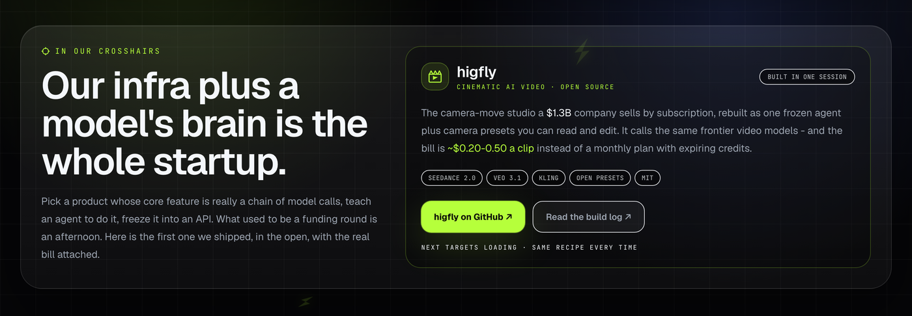

[](https://github.com/FlyMyAI/build-with-flymyai)
[](https://flymy.ai/media)
[](BUILD_LOG.md)
[](#why-it-exists)
[](LICENSE)

**We rebuilt the core of Higgsfield, a $1.3B company, from ~one prompt - and the infra it runs on is live at [flymy.ai/media](https://flymy.ai/media/).**

higfly makes cinematic clips: type a shot, pick a camera move, get a video. **~$0.20-0.50 per clip** instead of $5-99 a month in credits that expire. The camera presets are plain text you can read, fork and change.

Nobody wrote a pipeline. FlyMy.AI is text-programmable AI infrastructure: you describe the AI backend in plain words, and it gets built, frozen into an API and hosted for you in minutes. No GPUs to rent, no provider accounts, no deploy. The same infra is sitting there for whatever you want to build.

Here is the whole build, verbatim - paste it into a coding agent with the FlyMy.AI MCP connected:

```text
Claude, build me a Higgsfield-style video studio: a landing page where a user
types a shot and picks a camera move, and on FlyMy.AI a set of agents that
render it. Camera moves I want: 1) crash zoom, 2) dolly in, 3) orbit around
the subject, 4) crane up reveal, 5) FPV drone flythrough, 6) handheld follow.
Pick the best video model for cost and quality, freeze the working agent into
an API, host it there and hand me the endpoint plus the real price per clip.
Go.
```


That is it: connect the MCP once, say what you want, and the agents are created, run, frozen and hosted in the FlyMy.AI cloud - you get back an endpoint and the real bill. (The run above is recreated from [BUILD_LOG.md](BUILD_LOG.md): same model, same $0.20 clip, same ~140s render.)

```
your shot + a camera preset  ->  one frozen FlyMy.AI agent  ->  Seedance 2.0 / Veo 3.1 / Kling  ->  a clip in your storage
```

## How it works

1. You write a shot and pick a [camera move](presets/camera-moves.md).
2. A frozen FlyMy.AI agent renders it on the right frontier video model.
3. The clip lands in your storage, billed per clip to your own key.

That is the whole product: **one frozen agent + presets you can read and edit.** No studio to log into, no credits to burn.

## Try it in three steps

1. **Connect FlyMy.AI to your coding agent:**
   ```bash
   claude mcp add --transport http flymyai https://mcp-agents.flymy.ai/mcp
   ```
   (claude.ai / Codex / Antigravity: add the same URL as an MCP connector, sign in with [flymy.ai](https://app.flymy.ai).)
2. **Paste the prompt** from [BUILD_PROMPT.md](BUILD_PROMPT.md) - it creates the agent on *your* account, renders a clip and shows you the real bill.
3. **Make a shot.**

## Why it exists

Higgsfield is a **$1.3B** company and what it sells is real - a slick studio, one-click viral VFX, director-grade presets. But underneath it resells the **same frontier video models** (Sora, Veo 3.1, Kling, Seedance 2.0, WAN) wrapped in camera-move prompts, and bills a subscription whose credits expire. FlyMy.AI hosts those same models, so higfly calls them directly and ships the camera moves as open text.

| | Higgsfield | higfly |
|---|---|---|
| Price | **$5-99/mo** in credits (reset monthly, top-ups expire in 90 days) | **~$0.20-0.50 per clip**, pay-per-use |
| Models | the frontier video models, behind credits | the same models, called directly |
| Camera presets | in-app, locked | open text in [`presets/`](presets/), yours to edit |
| Lock-in | account + monthly credits | your key, your storage, forkable agent |

**Honestly:** their studio polish, preset library and their own DoP model are a real edge, and we do not claim to out-polish them. We claim you can own the same models and open presets at per-clip cost instead of renting them monthly.

## Built on FlyMy.AI



higfly took one session because none of the hard parts were ours to build: models, GPU capacity, storage, retries, versioning and billing all come with the platform. You teach an agent in plain text, freeze the run that worked into an API, and call it from your product - **infra on us.**

The same recipe works on any product whose core feature is really a chain of model calls. higfly is simply the first one we shipped in the open:



See the live demo stand and run an agent yourself: **[flymy.ai/media](https://flymy.ai/media)**

## Part of Build with FlyMy.AI

higfly is one demo in **[Build with FlyMy.AI](https://github.com/FlyMyAI/build-with-flymyai)** - a series where each app rebuilds a venture-funded product from a single prompt, with Claude as the builder and the FlyMy.AI agentic cloud as the backend, and publishes the real bill. The umbrella repo holds the shared playbook, the agent rules and the other demos:

- **higfly** (you are here) - cinematic AI video, ~$0.20-0.50 a clip
- [WhisperFly](https://github.com/FlyMyAI/whisperfly) - dictation straight into Notion, ~$0.03 a note
- [replifly](https://github.com/FlyMyAI/replifly) - "deploy my code to prod" on your own accounts

Want to build your own kill? Start with the [playbook](https://github.com/FlyMyAI/build-with-flymyai/blob/main/PLAYBOOK.md).

## What is and is not shipped

- **Shipped:** the frozen-agent design ([agent/prompt.md](agent/prompt.md)), the camera-move presets ([presets/](presets/)), the one-paste build prompt and the full build log.
- **Not yet:** a standalone CLI and a desktop studio.

Timestamped build history, real billed prices and every dead end: [BUILD_LOG.md](BUILD_LOG.md).

## License

MIT.
